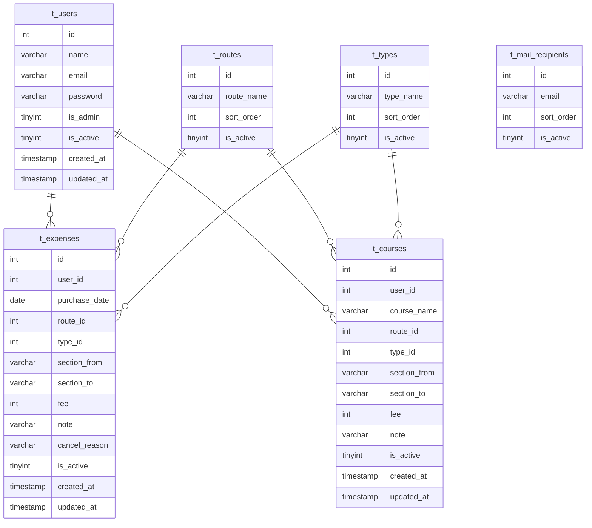

# 旅費請求システム（Expense Management System）

## Overview
社内向けの旅費請求業務を効率化するためのWebアプリケーションです。  
ユーザーの申請から管理者のデータ管理を一元管理できる構成でPHP8を用いて開発しています。

## Demo
**URL**
- https://dolzap.conohawing.com/expense/

**Demo Account**
- USER：demo@example.com
- PASS：demo1234

**Note**
- デモ環境では一部機能（管理機能・メール送信）に制限があります
- データは毎日0時に自動リセットされます

## Features
### User
- ログイン / ログアウト機能
- セッションタイムアウト機能
- 旅費請求機能（10件まで同時申請可能）
- 請求履歴確認機能（一覧・絞り込み検索）
- よく使うコース機能（一覧・登録・編集・削除）

### Admin
- 請求データ管理機能（一覧・CSVダウンロード・絞り込み検索）
- ユーザー管理機能（一覧・登録・編集・削除）
- メール宛先管理機能（一覧・登録・編集・削除・並び替え）
- 路線マスタ管理機能（一覧・登録・編集・削除・並び替え）
- 種別マスタ管理機能（一覧・登録・編集・削除・並び替え）

### Batch
- 実行ログ出力機能
- 多重起動防止機能
- デモデータリセット処理（毎日0時に実行）
- デモデータ再投入処理（毎日0時に実行）

## Stack
### Frontend


### Backend


### Infrastructure


### Others


## Directory
```bash
expense/
├── htdocs/
│   ├── index.php             # ルーティング（ユーザー）
│   ├── admin/                # ルーティング（管理）
│   ├── js/                   # JavaScript
│   ├── css/                  # CSS
│   └── img/                  # 画像
├── lib/
│   ├── conf/
│   │   └── Common.conf.php   # 定数設定
│   ├── sys/
│   │   ├── controllers/      # コントローラ
│   │   ├── modules/          # ビジネスロジック / DAO
│   │   └── batch/            # バッチ処理
│   └── templates/
│       ├── user/             # Smartyテンプレート（ユーザー）
│       └── admin/            # Smartyテンプレート（管理）
├── packages/
│   ├── smarty/               # Smarty（外部）
│   └── adodb5/               # ADODB（外部）
├── applogs/                  # ログ出力
└── .env                      # 環境変数
```

## Database
### t_users（ユーザーデータ）
| Column      | Type         | Null | Key | Default              | Description |
|-------------|-------------|------|-----|----------------------|------------|
| id          | INT(11)     | NO   | PK  | AUTO_INCREMENT       | ユーザーID |
| name        | VARCHAR(40) | NO   | -   | -                    | 氏名 |
| email       | VARCHAR(255)| NO   | UQ  | -                    | メールアドレス |
| password    | VARCHAR(255)| NO   | -   | -                    | パスワード（ハッシュ化） |
| is_admin    | TINYINT(1)  | NO   | -   | 0                    | 管理者フラグ |
| is_active   | TINYINT(1)  | NO   | -   | 1                    | 有効フラグ |
| created_at  | TIMESTAMP   | NO   | -   | CURRENT_TIMESTAMP    | 登録日時 |
| updated_at  | TIMESTAMP   | NO   | -   | CURRENT_TIMESTAMP    | 更新日時 |

### t_expenses（請求データ）
| Column        | Type          | Null | Key | Default           | Description |
|--------------|--------------|------|-----|------------------|------------|
| id           | INT(11)      | NO   | PK  | AUTO_INCREMENT   | 申請ID |
| user_id      | INT(11)      | NO   | -   | -                | ユーザーID |
| purchase_date| DATE         | NO   | -   | -                | 購入日 |
| route_id     | INT(11)      | NO   | -   | -                | 路線ID |
| type_id      | INT(11)      | NO   | -   | -                | 種別ID |
| section_from | VARCHAR(40)  | NO   | -   | -                | 区間（始） |
| section_to   | VARCHAR(40)  | NO   | -   | -                | 区間（終） |
| fee          | INT(11)      | NO   | -   | -                | 料金 |
| note         | VARCHAR(100) | YES  | -   | NULL             | 訪問先 |
| cancel_reason| VARCHAR(255) | YES  | -   | NULL             | 取消理由 |
| is_active    | TINYINT(1)   | NO   | -   | 1                | 有効フラグ（論理削除） |
| created_at   | TIMESTAMP    | NO   | -   | CURRENT_TIMESTAMP| 登録日時 |
| updated_at   | TIMESTAMP    | NO   | -   | CURRENT_TIMESTAMP| 更新日時 |

### t_courses（よく使うコースデータ）
| Column        | Type          | Null | Key | Default           | Description |
|--------------|--------------|------|-----|------------------|------------|
| id           | INT(11)      | NO   | PK  | AUTO_INCREMENT   | コースID |
| user_id      | INT(11)      | NO   | -   | -                | ユーザーID |
| course_name  | VARCHAR(40)  | NO   | -   | -                | コース名 |
| route_id     | INT(11)      | NO   | -   | -                | 路線ID |
| type_id      | INT(11)      | NO   | -   | -                | 種別ID |
| section_from | VARCHAR(40)  | NO   | -   | -                | 区間（始） |
| section_to   | VARCHAR(40)  | NO   | -   | -                | 区間（終） |
| fee          | INT(11)      | NO   | -   | -                | 料金 |
| note         | VARCHAR(100) | YES  | -   | NULL             | 訪問先 |
| is_active    | TINYINT(1)   | NO   | -   | 1                | 有効フラグ（論理削除） |
| created_at   | TIMESTAMP    | NO   | -   | CURRENT_TIMESTAMP| 登録日時 |
| updated_at   | TIMESTAMP    | NO   | -   | CURRENT_TIMESTAMP| 更新日時 |

### t_mail_recipients（メール宛先データ）
| Column      | Type          | Null | Key | Default           | Description |
|------------|--------------|------|-----|------------------|------------|
| id         | INT(11)      | NO   | PK  | AUTO_INCREMENT   | メールID |
| email      | VARCHAR(255) | NO   | UQ  | -                | メールアドレス |
| sort_order | INT(11)      | NO   | -   | -                | 表示順 |
| is_active  | TINYINT(1)   | NO   | -   | 1                | 有効フラグ（論理削除） |
| created_at | TIMESTAMP    | NO   | -   | CURRENT_TIMESTAMP| 登録日時 |
| updated_at | TIMESTAMP    | NO   | -   | CURRENT_TIMESTAMP| 更新日時 |

### t_routes（路線データ）
| Column      | Type          | Null | Key | Default           | Description |
|------------|--------------|------|-----|------------------|------------|
| id         | INT(11)      | NO   | PK  | AUTO_INCREMENT   | 路線ID |
| route_name | VARCHAR(40)  | NO   | UQ  | -                | 路線名 |
| sort_order | INT(11)      | NO   | -   | -                | 表示順 |
| is_active  | TINYINT(1)   | NO   | -   | 1                | 有効フラグ（論理削除） |
| created_at | TIMESTAMP    | NO   | -   | CURRENT_TIMESTAMP| 登録日時 |
| updated_at | TIMESTAMP    | NO   | -   | CURRENT_TIMESTAMP| 更新日時 |

### t_types（種別データ）
| Column      | Type          | Null | Key | Default           | Description |
|------------|--------------|------|-----|------------------|------------|
| id         | INT(11)      | NO   | PK  | AUTO_INCREMENT   | 種別ID |
| type_name  | VARCHAR(40)  | NO   | UQ  | -                | 種別名 |
| sort_order | INT(11)      | NO   | -   | -                | 表示順 |
| is_active  | TINYINT(1)   | NO   | -   | 1                | 有効フラグ（論理削除） |
| created_at | TIMESTAMP    | NO   | -   | CURRENT_TIMESTAMP| 登録日時 |
| updated_at | TIMESTAMP    | NO   | -   | CURRENT_TIMESTAMP| 更新日時 |

## ER


## License
MIT
